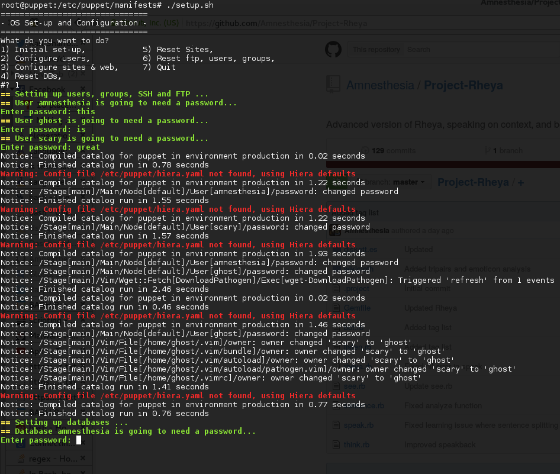

# (Interactive) Puppet Configuration

I just needed a way to set up my server without storing passwords in clear text. These manifests are based on templates generated using temporary Facts exported when running the `setup.sh` script. 

## Features
* Create a User
    * Export variables for user passwords (temporary)
    * Install vim, git, oh-my-zsh
    * Creates a manifest file for the user (will request new password next time it's applied)
    * Optionally create a Rails app or Wordpress app and link to home directory of user
* Create a Rails app
    * Creates postgresql database
    * Creates a new app or downloads source from GitHub if provided
    * Creates a Rails app and optionally links it to a user
    * Creates new `secrets.yml` and inserts `database.yml` with new values
    * Sets up nginx web server, rails served by puma 
    * Saves as new manifest file in 01-databases and 02-sites
* Create a Wordpress app
    * Creates a mariadb database
    * Installs Wordpress or downloads source from GitHub if provided
    * Sets up nginx site
    * Creates new `wp-config.php` with updated values
    * Saves as new manifest file in 01-databases and 02-sites
* Apply all existing manifests
* Apply saved databases only
* Apply saved sites only
* Apply system configuration only

## Todo

* Add scripts for Arch machines (laptop/desktop)
* Add scripts to remove user / site / database (create manifest and apply, remove again)
* Automagically create manifests to roll back changes
* Prepend dates to filename and allow user to roll back to earlier dates
* Finish Open Monitoring Distribution configuration
* Include Jenkins and add jobs to continuously update sites cloned from git repositories
